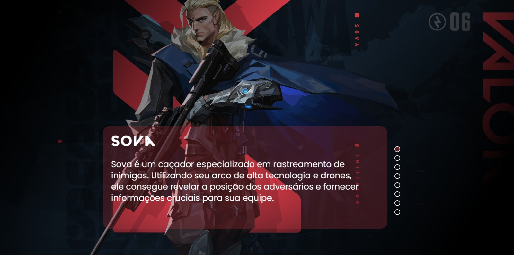

# Estudo de Front-End com HTML, CSS e JavaScript - Tema Valorant

Este projeto foi desenvolvido como parte dos meus estudos em front-end, focando no uso de HTML, CSS e JavaScript para criar uma página web interativa com tema do jogo **Valorant**. O principal objetivo deste projeto foi aprender a manipular elementos da página usando JavaScript, com ênfase na criação de um carrossel de imagens dinâmico.

## Funcionalidades

- **Carrossel de Imagens Dinâmico**: O carrossel permite que o usuário visualize diferentes imagens relacionadas ao Valorant ao clicar em botões de navegação.
- **Interatividade com JavaScript**: A mudança das imagens no carrossel é feita de forma dinâmica utilizando JavaScript.
- **Estilização com CSS**: A página foi estilizada utilizando CSS para garantir uma boa apresentação e usabilidade, mantendo a estética temática de Valorant.

## Tecnologias Utilizadas

- **HTML5**: Utilizado para estruturar a página e os elementos do carrossel.
- **CSS3**: Usado para estilizar a página, incluindo a formatação e layout do carrossel, com cores e fontes inspiradas no jogo Valorant.
- **JavaScript**: Responsável por adicionar a funcionalidade dinâmica ao carrossel, permitindo a navegação entre as imagens.


Capturas de Tela
Carrossel de Imagens de Valorant
Aqui está uma captura de tela do projeto em funcionamento:




## Como Usar


1. Clone este repositório:
   ```bash
   git clone https://github.com/seu-usuario/nome-do-repositorio.git
